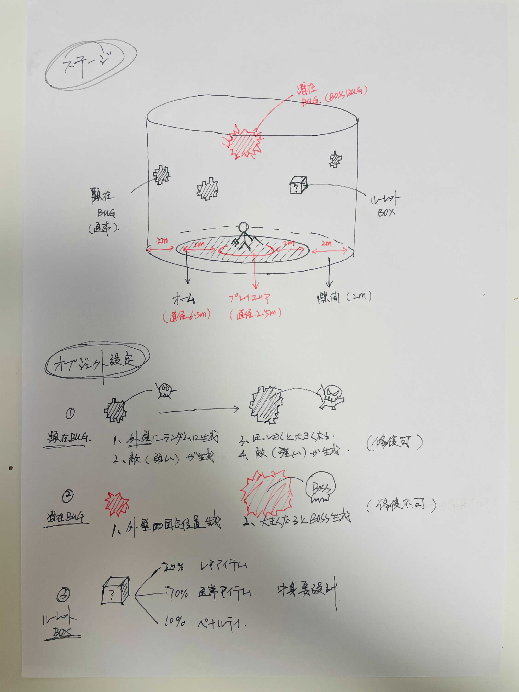
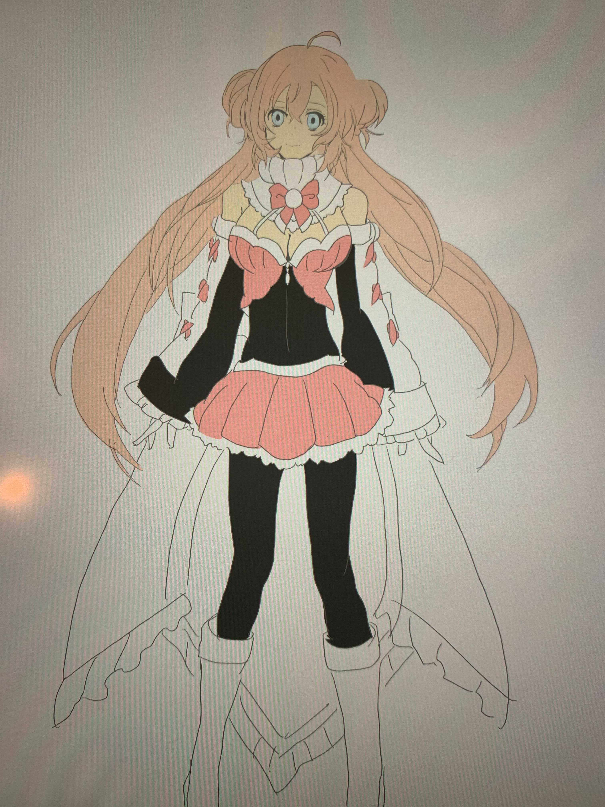

= 企画書

== タイトル

TBD

== ジャンル

VR、バトルアクション

== コンセプト（5W1H）

* Who: 
* When: 
* Where: 
* Why: 
* How: 
* What: 

[NOTE]
企画の目的などを明らかにするために作成。
あくまでこのゲームを作成するためのコンセプトでストーリーに関する5W1Hではない

== プラットフォーム

動作環境: PC
開発環境: unity

== ターゲット

今回は特に考えない

== 開発メンバー
邵、佐々岡、朱、山東、向井

== 世界観
電脳世界、VRチャット

== ストーリー
=== 背景
20XX年、この世界ではVRアバターと現実の人格とのリンクが進み
ついに現実の人格をVRに移植することもできるようになった。

主人公は現実人格を持ちつつ、VRチャットをプレイする人間だが、実はヒロインはVRに人格を移植したアイドル。
突然の病でこの世を去ったものの、世間には公表されずVR世界で生き続けていた。

=== 展開
念願のヒロインのライブに当たり、大喜びの主人公。
見に行く当日、周りを凍らさないように厚着の格好をし、いざ会場に向かう。
早めに会場に着き、歩いてるとまさかのヒロインとばったり、憧れのヒロインと話す展開に。
歩きながら自分がずっとファンであることや好きなことを話して平和な空気が流れる中、目の前のアバターが何やら不穏な動きを、そこから事件が始まる。

VRチャットの回線に入り込んだウイルスや、バグがVR世界やアバターを壊していく。
主人公はこれを止めるため、ヒロインと共にステージを乗り越えつつ、ウイルスの根幹を突き止めるべく世界を冒険する。

== 機能
link:./specifications/function.adoc[機能定義書]に記載

== ステージ
基本的に円筒状のステージからせりだした床と、円筒中央に配置された床がステージ。 +

== オブジェクト
.顕在バグ
* 設定1:ステージ生成時にランダムに外壁に作成されるバグ。
* 設定2:バグからウイルスなどの敵が発生する。
* 設定3:放っておくと大きくなる

.潜在バグ
* 設定1:ステージの固定位置に発生するバグ
* 設定2:顕在バグを修復することで発生
* 設定3:潜在バグからはBOSSが発生する

.アイテムボックス
* 設定1:破壊すると取得できる
* 設定2:中から確率でアイテムを取得できる

== クリア条件

潜在バグから発生したBOSSの撃破、潜在バグの修復（レアアイテムによる修復など）

== キャラクター

.主人公
* 性格:ヒロアカのデクくんみたいなやつ
* 根暗、引っ込み思案、でも勇気ある的な
* 服:白、青(氷使えるキャラ的な色)
* 髪:白
* 設定:ヒロインのファン
寒い地域のVRchatのエリアに住んでいる。
周りもみんなも髪は白く、目は青い。
自分の冷却力が強く、周りが凍りつく。VRchatにいる人は少し冷ややかな目で見てる。あんまり誰も近寄らない。
* イメージ: TBD

.ヒロイン
* 性格:明るい、元気、頑張り屋さん、人気者
* 職業:VR　chat歌手
* 服:黒、ピンク(主人公と対極)
* 髪:ピンク
* 設定
地下アイドル的な所から頑張って一流アイドルになった設定。
ファン多い(主人公もファン)
* イメージ: 

.敵その１
* 設定:接近攻撃系
* イメージ: TBD

.敵その２
* 設定:遠距離物理攻撃系
* イメージ: TBD

.敵その３
* 設定:遠距離魔法攻撃系
* イメージ: TBD

.敵その4
* 設定:飛行系
* イメージ: TBD

== アイテム

TBD

== 操作方法
link:./specifications/controller.adoc[操作定義書]に記載

== 画面遷移
link:./specifications/screen-transition.adoc[画面遷移図]に記載