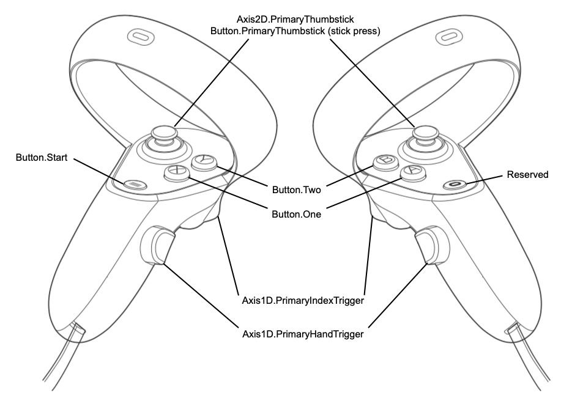

:toc: 
:toclevels: 3
:toc-title: 目次

= 操作仕様書
本ドキュメントではコントローラによる操作インプットと動作の対応を記載する

== ボタン用語対応表

|===
| 上記画像ボタン名 | 呼称 
| PrimaryThumbstick(right) | 右スティック 
| PrimaryThumbstick(left) | 左スティック
| Button.One(right) | Aボタン
| Button.Twe(right) | Bボタン
| Button.One(left) | Xボタン
| Button.Twe(left) | Yボタン
| PrimaryIndexTrigger(right) | 右トリガー
| PrimaryIndexTrigger(left) | 左トリガー
| PrimaryHandTrigger(right) | 右グリップ
| PrimaryHandTrigger(left) | 左グリップ
|===

== 操作一覧

=== メニュー画面

==== Aボタン/右トリガー/左トリガー
---
- 決定

==== Bボタン
---
- 戻る

==== 右スティック/左スティック
---
- カーソルの移動（RayCastでも指定可能） 

=== 戦闘画面

==== Aボタン
---
- 未割当

==== Bボタン
---
- 右手の武器を持ち替える

==== Xボタン
---
- 戦闘メニュー画面を開く

==== Yボタン
---
- 左手の武器を持ち替える

==== 右/左トリガー
---
- 銃弾を発射する（銃を持っている場合）
- 押している間ワイヤーを伸ばす（ワイヤー銃を持っている場合）
- 放すとワイヤーを縮める（ワイヤーを出している場合）

==== 右/左グリップ
---
- 爆弾などを掴める(武器を持っていない場合)
- ワイヤーを切る（ワイヤーを発射している場合）

==== 右スティック
---
- 左右に倒すと、決まった角度視野が回転する（snap turn）

==== 左スティック
---
- 未割当

